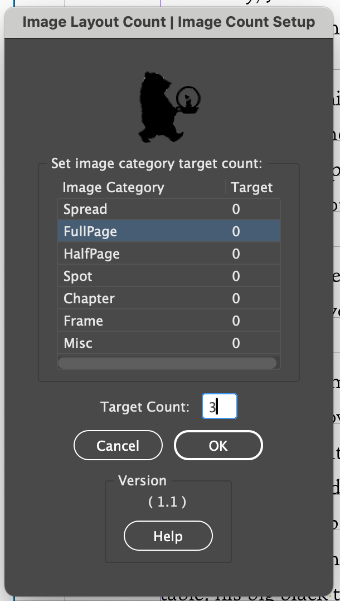

# PicTotter

## Overview

It is a fiddly task to count different types/sizes of images across a illustrated fiction book. This suite of scripts is a tool to help designers to set up frames with image briefs and communicate the counts to illustrators and agents, and give them more time to imagine and design.

There are currently 5 scripts in the Image Count for Briefing suite available in Indesign:

01. Create Styles – to initialise the system and set up a layer, an object style, and a group of paragraph styles on which the rest of the scripts run
02. Frame Classification – to auto-categorise frames after the designer has added in briefs
03. Frame Counter – to set target counts for each category of image, count each time, and report back the count of images used
04. Brief Export – to export the page number, type, and brief for each image to one text document that can be emailed to the agent/illustrator
05. Sketch Frame Creation – to take the frames created, duplicate them with appropriate properties to the Sketches and Text Wrap layers and hide the briefing note frames.

These are created separately so that they can be used by designers throughout the process and allows them to retain control of which script they use when.

## Setup

In the future, when they are tested and robust, I would like these scripts to be part of the Premedia panels. In the meantime, they can be installed by Anna.

The scripts can be found by opening the scripts panel in Indesign by going to Window > Utilities.


You can keep the Scripts panel by adding it to your menu and then saving your workspace. Open the scripts panel, then expand the PrePress section, then the Image Layout Count section. It will look like this:


>The scripts will only work when a document is open. For best practice, set up the document using the Create Layers script and save the document before using these new scripts.

## 01 Create Styles

### Overview

This InDesign script initialise the process by creating a new layer, a set of paragraph styles and an object style specifically designed for this process.

> **HOW?** <br> The system works by maninpulating the ability to create different numbering lists in Indesign. I've set up an alpha system to test the theory, and this is an automation of that.

### Purpose

The script automates the creation of a standardized style system for art counting, helping the designers by:
1. Ensuring that setup is easy and doesn't add to designer workload
2. Keeping the brief frames on a separate layer enables good working practice.

### Prerequisites

1. An open, saved InDesign document

### How to Activate the Script

1. Open your InDesign document and save your progress.
2. Run the script by selecting the script, right clicking and selected Run Script.


3. The script will automatically create or update the necessary styles.
4. A confirmation dialog will appear, listing the created or updated styles.


### Created Styles

The script creates the following:

1. Style Folder: "Art Counter Styles"


   - Layer called Image Count with a black border.
   - It is positioned on top of the Text layer so that the Text Wrap will take effect.

2. Object Style: "Art Counter Frame"


   - Frame with a paper fill and cyan border. It has a text wrap basd on the bounding box with 10pt offset on all sides
   - Feel free to change the type of text wrap as appropriate for your images, but keep all frames with this Object Style.

3. Numbered Paragraph Styles (all based on "Further Art Notes"):


   - Spread – for images that take up the whole spread
   - FullPage – for images that take up the whole page (or half a spread)
   - HalfPage – for images larger than a spot and take up no more than half a page
   - Spot – for images that are spots
   - Chapter – for images that are positioned above the chapter openers
   - Frame – for images that are going to be frames around text
   - Misc – for any other images that don't fit into them

   Each of these styles:
   - Is numbered with the type of image (e.g., "Spread 2: ") so that you can check what style is applied
   - Is set to switch to "Further Art Notes" style for the next paragraph

> **NOTE**<br>
Don't create new styles because the rest of the system just won't work. The styles have been created based on feedback about the most used styles. Each project will be different and you can use one, or all, or any in combination. If other styles are need, let me know and I can look at integrating them.

4. Parent Style: "Further Art Notes"
This is the parent style to which all the other styles are applied, because it keeps a consistency. Use this to extend any briefing notes you have – it won'be be counted!
- Font: Helvetica, 12pt/14pt, in Cyan and with hyphenation disabled
> **NOTE**<br>
You can edit this a bit to suit your preferences, but this seems too be the way most of us set up documents. Don't fiddle too much – stick to basic font/typesize/colour changes.

### How to Use the Script

After running the script:

1. Use the "Art Counter Frame" object style for text frames containing art descriptions.
2. Apply the appropriate numbered style (Spread, FullPage, etc.) to the first paragraph of each art description.

    > **TOP TIP!** <br>
  This system works on a list basis, so you need to type a few words (or simply a space) for the numbering to show up.

4. Subsequent paragraphs in the same frame will automatically use the "Further Art Notes" style – all you need to do is press Enter.


You can see here that the numbering of the Spot Images isn't in order. InDesign has its own way of numbering lists as to what comes first, so as long as the overall is right, it'll be fine.

If you encounter issues:

1. Ensure you have an open document before running the script.
3. If styles are not updating as expected, try deleting the existing styles and re-running the script.
3. Sometimes you might have to reapply the Object Style or Paragraph Style. A little quirk of InDesign.
4. For any persistent issues, contact Anna.


## 02 Frame Classification – Beta

### Overview

This script is rather clever and automatically detects the size and position and applies the correct style – in theory. 

### Prerequisites

1. Your InDesign document must be in facing pages mode.
2. An "Image Count" layer must exist in your document.
3. The "Art Counter Styles" paragraph style group must be present in your document, containing the following styles:
   - Spread
   - FullPage
   - HalfPage
   - Chapter
   - Spot
   - Misc
   - Further Art Notes

### How to Use the Script

1. Open your InDesign document.
2. Run the script (Scripts > Prepress > Image Layout Count > 02 Frame Classification.jsx).
3. The script will auto-classify every frame on the Image Count layer on normal and Parent/Master pages and wipe out any classification you might have added in yourself, as well as any formatting. Any frame that does not correspond to the specifications laid out will be classified as Misc; and frame marked with Frame will remain so. It is recommended that you check through the document thoroughly yourself after proceeding. 
3. Click "OK" to proceed or "Cancel" to abort.


4. The script will process all frames on the "Image Count" layer, including those on master pages.
5. Each frame will be classified based on its size and position relative to the page and text block.
6. The appropriate paragraph style from the "Art Counter Styles" group will be applied to the text in each frame.

### Classification Logic

The script classifies frames as follows:

- **Spread**: Frames larger than the text block height and wider than a single page.
- **FullPage**: Frames on a single page that are either:
  - Larger than the text block but smaller than or equal to the page size, or
  - Up to the full page height and at least 90% of the page width.
- **HalfPage**: Frames on a single page that are no taller than half the page height and wider than the text block width.
- **Chapter**: Frames on a single page, within the text block size, positioned in the top half of the page, and if there's a paragraph style containing "chapter" on the same page in the "Text" layer.
- **Spot**: Frames on a single page that fit within the text block size.
- **Misc**: Any frame that doesn't fit the above categories.

### Important Notes

- The script will overwrite any existing classifications or formatting in the frames.
- Frames with text already styled as "Frame" will not be modified.
- For frames with multiple paragraphs, only the first paragraph receives the classification style. Subsequent paragraphs are styled as "Further Art Notes".
- All character styles and overrides are removed from the text content.
- After running the script, it's recommended to review the document thoroughly to ensure accurate classification.

### Troubleshooting

If you encounter issues:

1. Ensure your document is in facing pages mode.
2. Verify that the "Image Count" layer exists and contains the frames you want to classify.
3. Check that the "Art Counter Styles" paragraph style group is present with all required styles.
4. If specific frames are not classified as expected, review their size and position relative to the page and text block.


## 03 Frame Counter

### Overview

The Frame Counter script is a powerful tool for InDesign users to count and manage different types of image frames in their documents. It allows you to set target counts for various image categories and compare them with the actual counts in your document.

### Key Features

1. Counts image frames based on predefined paragraph styles
2. Allows setting target counts for each image category
3. Provides a user-friendly interface for setting targets and viewing results
4. Stores count information in document metadata for persistence
5. Generates a detailed log file for debugging purposes

### How to Use

#### 3. Setting Target Counts


When you run the script, you'll see the "Image Count Setup" dialog:

1. Select an image category from the list
2. Enter the target count in the "Target Count" field



3. Repeat for other categories as needed – leave at 0 if you don't need it.
4. Click "OK" to save your targets, or Cancel to leave the party.


> **NOTE**<br>
When you press the OK button, you'll get the Beachball of Death. The script needs time to process your beautiful work, so be patient. Later examples might get around this.

#### 4. Viewing Results


After setting targets, you'll see the "Image Count Results" dialog. In this example I've set out an number for each category you'd expect to see, and what the differences are between your target and what you have in each category.

- This shows a summary of actual counts, targets, and the difference for each category
- Positive differences indicate you have more frames than targeted
- Negative differences indicate you have fewer frames than targeted

Close the dialog and open it again! Your targets are saved.

> **HOW**<br>
The script saves your target counts by literally writing it into the metadata of the file in the same way as other Premedia scripts gather and save information.

#### 5. Interpreting Results

Use this information to:
- Ensure you have the right number of images for each category
- Identify areas where you might need to add or remove images
- Track your progress as you work on the document

#### Troubleshooting

If you encounter issues:

1. Check the debug log file on your desktop (named "FrameCounterDebug_[YourDocumentName].log") and send to Anna for interpretation
2. Ensure your paragraph styles match the predefined categories, and don't have more than one countable paragraph style per frame
3. Try closing and reopening your document, then run the script again

#### Tips for Efficient Use

1. Run the script periodically as you work to track your progress
2. Use consistent paragraph styles for your image frames
3. Set realistic targets based on your document's requirements
4. Update targets as needed if your image requirements change

Remember, the Frame Counter is here to help you maintain consistency and meet your image count goals. Happy designing!

## 04 Brief Export

### Overview

The next script allows you to quickly generate a text document listing image types, pages, and briefings for each image in their document. Usually we do brief illustratros with spread layours, but sometimes text can adds to the brief.


### How to Use

1. **Open Your InDesign Document**: Start by opening the InDesign document you want to process.

2. **Run the Script**: Navigate to Scripts > Prepress > Image Layout Count > 02 Frame Classification.jsx

3. **Dialog Box**: A dialog box will appear with information about the script's function.
   
   

4. **Confirm Action**: Click "OK" to proceed or "Cancel" to exist.

5. **Processing**: The script will the brief and display this Success dialog.

   [image](./Images/BriefCountSuccess.png)

6. **Output**: A text file named "[YourDocumentName]_ImageBrief.txt" will be created in the same folder as your InDesign document.

   [image](./Images/BriefCountLog.png)

### Requirements

- The script requires an "Image Count" layer in your InDesign document. Ensure this layer exists and contains the relevant text frames with image information.

- Text frames in the "Image Count" layer should use specific paragraph styles:
  - One style for the image type
  - One style for the main content
  - "Further Art Notes" style for additional information

### Output Format

The generated text file will have the following format for each image:

```
[Page Number]–[Image Type]
[Main Content]
[Further Art Notes (if any)]
```
> **NOTE**<br>It would be great to export the brief straight to an email, but I'm reasonable sure that would break fundamental rules of the universe/Adobe's licensing T&Cs.

### Troubleshooting

- If you receive an error about the "Image Count" layer not being found, check that your document has this layer and that it's spelled correctly.
- Ensure that your text frames use the correct paragraph styles for proper parsing.

### Tips for Best Results

- Keep your "Image Count" layer organized and consistent across all pages.
- Use clear, descriptive names for your paragraph styles to avoid confusion.
- Regularly update your image information to ensure the exported brief is accurate.


### Need Help?

If you encounter any issues or have questions about using the script, ask Anna.

## Image Brief to Layers Script Documentation

### Overview

The last piece in the puzzle. When briefing images, designers create text wrap around each frame to make the text flow, and when it comes to dropping in the first round of images, it is repetitive to ensure the rough and text wrap frames are on the right frames.

### Getting Started

1. Open your InDesign document containing the image brief.
2. Run the Premedia Create Layers Script.
2. Ensure you have a layer named "Image Count" with placeholder frames for your images.
3. Run the script by going to File > Scripts > [Your Script Name].


### What the Script Does

When you run the script, it performs the following actions:

1. Checks that you have these two layers:
   - "Sketches" layer 
   - "Text Wrap" layer 

2. Duplicates frames from the "Image Count" layer to both new layers.

3. Applies specific properties to each layer:
   - Sketches layer: Applies a "Sketch frames" object style (cyan fill, 10% tint, no stroke), no text wrap
   - Text Wrap layer: Removes fill and stroke, retains text wrap

4. Moves the "Image Count" layer to the top and locks it.

5. Removes text wrap from the original "Image Count" frames.


### Using the Script

1. **Open Your InDesign Document**: Start by opening the InDesign document you want to process.

2. **Run the Script**: Navigate to Scripts > Prepress > Image Layout Count > 02 Frame Classification.jsx

   

3. **Dialog Box**: A dialog box will appear with information about the script's function.
   
4. **Confirm Action**: Click "OK" to proceed or "Cancel" to exist.

5. **Processing**: The script will the brief and display this Success dialog.

   

5. **Success**: The script will the brief and display a Success dialog.

6. **Output**: The file will show your document with the new layers and frames.

   

### Tips for Best Results

- Ensure your "Image Count" layer contains only the frames you want to process.
- If you need to make changes, it's best to edit the original "Image Count" layer and run the script again.
- The "Sketch frames" object style is created automatically. You can modify this style in the Object Styles panel to change the appearance of your sketch frames.

### Troubleshooting

- If you receive an error message, check that your document has a layer named exactly "Image Count".
- Ensure you have permission to create new layers and styles in your document.

For any further assistance, please contact Anna.
